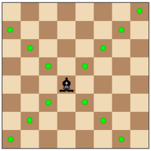
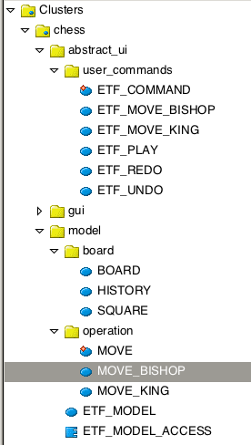

# Chess challenge (undo/redo design pattern)

You are provided with simple ETF starter project (in folder `bishop-chess`) to illustrate the undo/redo design pattern for a chess board with only two pieces, a king (K) and a bishop (B). The project should compile out of the box but is incomplete. The undo/redo design pattern is built on top of basic OO constructs such as static typing, dynamic binding and polymorphism. 

In job interviews with companies, students are often asked questions involving the movements of pieces such as kings, bishops or other game pieces. 

In a Labtest, to keep it simple and time-limited, we might provide you with an ETF starter project like this one, and ask you to design a game with two different pieces taken from kings, bishops, rooks, and knights. In the `docs` folder see `chess_moves.e`. See:
  
`directions_of_player (player: CHARACTER): ARRAY[TUPLE[x: INTEGER; y: 
  INTEGER]]`
  
The pieces move around on the board but do not "capture" each other but unlike normal chess they can jump over each other. A piece cannot move into an occupied square. 

* The king moves exactly one square horizontally, vertically, or diagonally.
*  A rook moves any number of vacant squares in a horizontal or vertical direction. 
*  A knight moves two squares horizontally then one square vertically, or moves one square horizontally then two squares vertically—i.e. in an "L" pattern.
*  A bishop moves any number of vacant squares in any diagonal direction.



Please read and understand the design/code and ensure that you get it working. 

Ensure that you understand how these pieces move. The abstract algorithm for any piece is in class MOVE. 

## Undo/redo design pattern

In this exercise, the focus is on the undo/redo design patternn, not the contracts (although you may find the use of preconditions in the business logic useful in debugging of your design). You do defensive programming at the user interface (ETF_COMMAND) due to the need for tolerant preconditions, but messages are kept simple to keep the challenge limited. In the buisiness logic, the preconditions are stronger to ensure the safety of the game with respect to the rules of chess moves, and thus there is much less need for defensive programming. 

The redo/undo design pattern is discussed in OOSC2 chapter 21, with the following goals:

 * The mechanism should be applicable to a wide class of interactive applications, regardless of the application domain.
 * The mechanism should not require redesign for each new input command.
 * **It should make reasonable use of storage**. (E.g. in this example, you must not store in the history of moves the whole board with all the pieces, just sufficent information to redo or undo the move. Note that in this example the history is unbounded and thus efficent storage is important). 
 * It should be applicable to arbitrary-levels of undo/redo.

 
## Model Cluster



In the starter project, the king moves on the board but not the bishop to give you some idea of the basic design. The deferred class MOVE* has a template pattern for moving different pieces on the board and also specifies deferred routines for undo and redo. Different pieces effect `directions` differently, to make use of polymorphism and dynamic binding. 

You will need to edit at least the foillowing:

* BOARD
* MOVE_BISHOP
* MOVE_KING
* ETF_MOVE\_BISHOP

## What you must do

Start by getting the acceptance test below working. Then write you own syntactically correct acceptance tests and ensure that the project (a) compiles and (b) is correct in all respects and (c) never crashes with exceptions, or non-termination. 

## The abtract grammar at the user interface

```
system chess
  -- just a King (K) and a Bishop (B) with undo/redo

type SIZE = 5..8
  -- size of board, e.g. 5 x 5

type SQUARE = TUPLE [x: 1..8; y: 1..8]

play(size: SIZE)
  -- create a board with `size` rows and `size` columns
  -- initially, the King is always at the top left [1,1] 
  -- and the Bishop is always at the bottom right [size, size]

 move_king(square: SQUARE)
   -- some moves not permitted
   -- either due to board size
   -- or because a square is occupied

 move_bishop(square: SQUARE)
   -- some moves not permitted
   -- either due to board size
   -- or because a square is occupied

 undo

 redo
```

## An example acceptance test

```
  ok, K = King and B = Bishop:
->play(5)
  ok:
  K____
  _____
  _____
  _____
  ____B
->play(8)
  game already started:
->move_bishop([4, 3])
  invalid move:
->move_bishop([1, 1])
  invalid move:
->move_bishop([2, 2])
  ok:
  K____
  _B___
  _____
  _____
  _____
->move_bishop([3, 1])
  ok:
  K____
  _____
  B____
  _____
  _____
->move_king([1, 8])
  invalid move:
->move_king([2, 2])
  ok:
  _____
  _K___
  B____
  _____
  _____
->move_king([3, 1])
  invalid move:
->move_king([3, 2])
  ok:
  _____
  _____
  BK___
  _____
  _____
->undo
  ok:
  _____
  _K___
  B____
  _____
  _____
->undo
  ok:
  K____
  _____
  B____
  _____
  _____
->undo
  ok:
  K____
  _B___
  _____
  _____
  _____
->undo
  ok:
  K____
  _____
  _____
  _____
  ____B
->undo
  no more to undo:
->redo
  ok:
  K____
  _B___
  _____
  _____
  _____
->redo
  ok:
  K____
  _____
  B____
  _____
  _____
->redo
  ok:
  _____
  _K___
  B____
  _____
  _____
->redo
  ok:
  _____
  _____
  BK___
  _____
  _____
->redo
  nothing to redo:
```


 